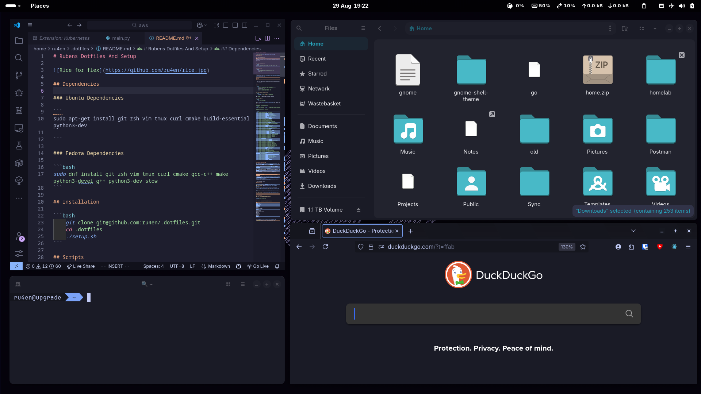
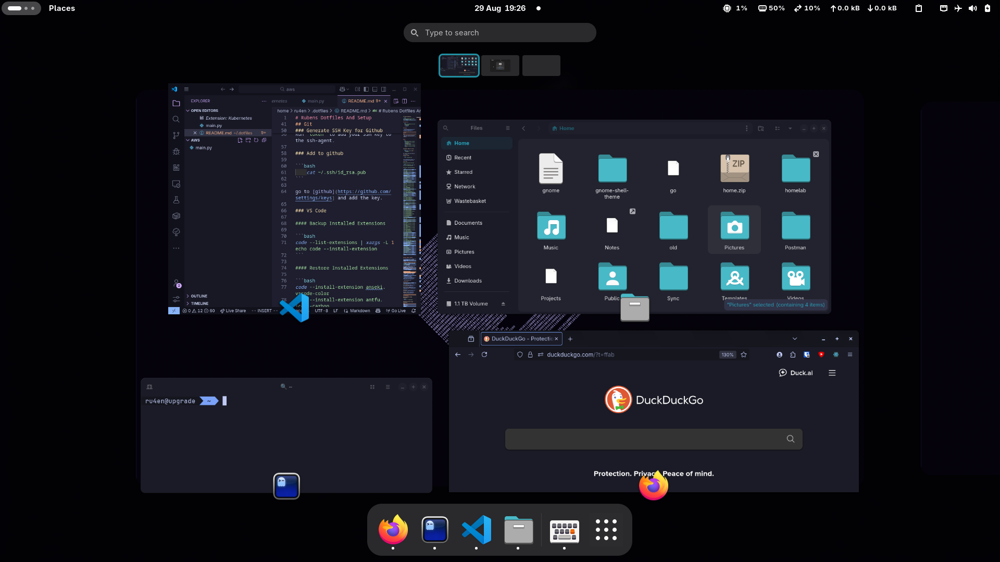
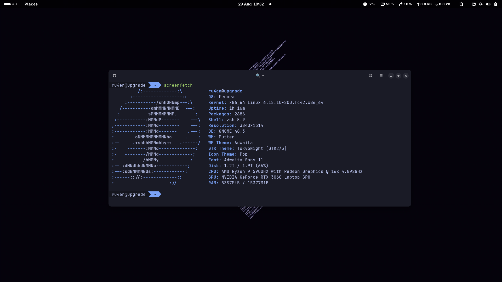

# Rubens Dotfiles And Setup


<div style="display: flex; flex-wrap: wrap; gap: 5px;">








</div>

## Dependencies

### Ubuntu Dependencies

```
sudo apt-get install git zsh vim tmux curl cmake build-essential python3-dev

```

### Fedora Dependencies

```bash
sudo dnf install git zsh vim tmux curl cmake gcc-c++ make python3-devel g++ python3-dev stow
```

## Installation

```bash
    git clone git@github.com:ru4en/.dotfiles.git
    cd .dotfiles
    ./setup.sh
```

## Scripts

- [auto-logout-key](https://github.com/ru4en/.dotfiles/tree/main/scripts/auto-logout-key)


## Fonts

```

 wget https://github.com/ryanoasis/nerd-fonts/releases/download/v3.2.1/Hack.zip

```

## Git

```bash
    git config --global user.name "Ruben Lopes"
    git config --global user.email "ru4en@pm.me" # or "dev@rubenlopes.uk"
    git config --global core.editor "vim"
    git config --global pull.rebase "true"
```

### Generate SSH Key for Github

```bash
    ssh-keygen -t rsa -b 4096 -C "ru4en@pm.me"
```

Run `token` to add your SSH key to the ssh-agent.

### Add to github

```bash
    cat ~/.ssh/id_rsa.pub
```

go to [github](https://github.com/settings/keys) and add the key.

### VS Code

#### Backup Installed Extensions

```bash
code --list-extensions | xargs -L 1 echo code --install-extension
```

#### Restore Installed Extensions

```bash
code --install-extension anseki.vscode-color
code --install-extension antfu.icons-carbon
code --install-extension batisteo.vscode-django
code --install-extension bradlc.vscode-tailwindcss
code --install-extension catppuccin.catppuccin-vsc
code --install-extension davidanson.vscode-markdownlint
code --install-extension enkia.tokyo-night
code --install-extension esbenp.prettier-vscode
code --install-extension fabiospampinato.vscode-diff
code --install-extension fill-labs.dependi
code --install-extension github.codespaces
code --install-extension github.copilot
code --install-extension github.copilot-chat
code --install-extension github.github-vscode-theme
code --install-extension github.remotehub
code --install-extension github.vscode-github-actions
code --install-extension github.vscode-pull-request-github
code --install-extension golang.go
code --install-extension gruntfuggly.todo-tree
code --install-extension hediet.vscode-drawio
code --install-extension mhutchie.git-graph
code --install-extension ms-azuretools.vscode-containers
code --install-extension ms-azuretools.vscode-docker
code --install-extension ms-python.debugpy
code --install-extension ms-python.python
code --install-extension ms-python.vscode-pylance
code --install-extension ms-python.vscode-python-envs
code --install-extension ms-toolsai.jupyter
code --install-extension ms-toolsai.jupyter-keymap
code --install-extension ms-toolsai.vscode-jupyter-cell-tags
code --install-extension ms-toolsai.vscode-jupyter-slideshow
code --install-extension ms-vscode-remote.remote-containers
code --install-extension ms-vscode-remote.remote-ssh
code --install-extension ms-vscode-remote.remote-ssh-edit
code --install-extension ms-vscode-remote.remote-wsl
code --install-extension ms-vscode-remote.vscode-remote-extensionpack
code --install-extension ms-vscode.cmake-tools
code --install-extension ms-vscode.cpptools
code --install-extension ms-vscode.cpptools-extension-pack
code --install-extension ms-vscode.makefile-tools
code --install-extension ms-vscode.powershell
code --install-extension ms-vscode.remote-explorer
code --install-extension ms-vscode.remote-repositories
code --install-extension ms-vscode.remote-server
code --install-extension ms-vscode.vscode-serial-monitor
code --install-extension ms-vscode.vscode-typescript-next
code --install-extension ms-vsliveshare.vsliveshare
code --install-extension njpwerner.autodocstring
code --install-extension oderwat.indent-rainbow
code --install-extension qwtel.sqlite-viewer
code --install-extension redhat.java
code --install-extension ritwickdey.liveserver
code --install-extension rust-lang.rust-analyzer
code --install-extension streetsidesoftware.code-spell-checker
code --install-extension teabyii.ayu
code --install-extension visualstudioexptteam.intellicode-api-usage-examples
code --install-extension visualstudioexptteam.vscodeintellicode
code --install-extension vscjava.vscode-gradle
code --install-extension vscjava.vscode-java-debug
code --install-extension vscjava.vscode-java-dependency
code --install-extension vscjava.vscode-java-pack
code --install-extension vscjava.vscode-maven
code --install-extension vscodevim.vim
code --install-extension waderyan.gitblame

```

## Nvidia Graphics Settings

Use [EnvyControl](https://github.com/bayasdev/envycontrol) for fixing graphics ishues such as screen tairing.


- Enable the repository with `sudo dnf copr enable sunwire/envycontrol`
- `sudo dnf install python3-envycontrol`

Set graphics mode to nvidia, enable ForceCompositionPipeline and Coolbits with a value of 24:
```
sudo envycontrol -s nvidia --force-comp --coolbits 24
```

## Firefox Extensions
- [Vimium](https://addons.mozilla.org/en-US/firefox/addon/vimium-ff/)
- [uBlock Origin](https://addons.mozilla.org/en-US/firefox/addon/ublock-origin/)
- [Bitwarden](https://addons.mozilla.org/en-US/firefox/addon/bitwarden-password-manager/)
- [Gnome Shell Integration](https://addons.mozilla.org/en-US/firefox/addon/gnome-shell-integration/)

- React Developer Tools

## Applications

### Terminal Emulator: [Ghostty](https://ghostty.org/)

### File Manager: [Nautilus](https://wiki.gnome.org/Apps/Nautilus)

### Text Editor: [Neovim](https://neovim.io/) or [VSCode](https://code.visualstudio.com/) or [vim](https://www.vim.org/)

### Browser: [Firefox](https://www.mozilla.org/en-US/firefox/new/)

### Email Client: [Thunderbird](https://www.thunderbird.net/)


## Flatpak Apps

### List Installed Flatpak Applications

```bash
flatpak list --columns=name
```

### Usually Installed Flatpak Applications

```
Dconf Editor
Arduino IDE v2
Bambu Studio
Bitwarden
Gradience
Eyedropper
Alpaca
Extension Manager
Spotify
Finamp
Field Monitor
Nvidia System Monitor
Whisper
Obsidian
Resources
Thunderbird
Iconic
Blender
Gaphor
Apostrophe
```

## [Wallpaper](https://github.com/ru4en/wallpaper.jpg)

